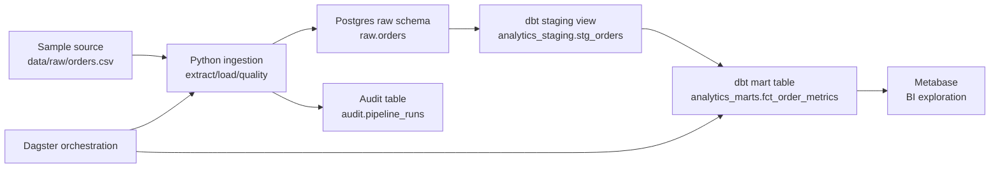

# Modern ELT Pipeline

A local ELT pipeline that demonstrates how Python, PostgreSQL, dbt, Dagster, and Metabase work together to ingest, validate, transform, and serve analytics-ready data.

It uses a small sample orders CSV to demonstrate the full workflow:

```text
source data -> ingestion -> raw warehouse table -> dbt staging -> dbt mart -> BI-ready output
```

## Purpose

This project demonstrates how the core pieces of a modern data pipeline fit together:

- Python handles ingestion and operational glue.
- PostgreSQL acts as the local warehouse.
- dbt transforms raw data into modeled analytics tables.
- Dagster orchestrates the pipeline and records runs.
- Metabase can connect to the modeled data for exploration.
- GitHub Actions provides a lightweight CI entry point.

The sample data is deliberately small. The goal is to show architecture, boundaries, and workflow, not data volume.

## Architecture



## Tech Stack

| Layer | Tool | Purpose |
| --- | --- | --- |
| Infrastructure | Docker Compose | Runs the local data platform consistently |
| Warehouse | PostgreSQL | Stores raw, staging, mart, and audit data |
| Ingestion | Python, pandas, SQLAlchemy | Reads source data and loads raw tables |
| Transformation | dbt Core, dbt-postgres | Builds tested SQL models |
| Orchestration | Dagster | Runs and observes pipeline assets |
| Data quality | Python SQL checks, dbt tests | Validates source and modeled data |
| BI | Metabase | Explores the final mart table |
| CI | GitHub Actions | Runs linting and Python tests |

## Data Flow

```text
data/raw/orders.csv
  -> raw.orders
  -> analytics_staging.stg_orders
  -> analytics_marts.fct_order_metrics
```

The final mart is a generic order metrics model. It is included to prove that the pipeline can produce a reporting-ready table from raw source data.

## Repository Structure

```text
.
|-- .github/workflows/ci.yml
|-- data/raw/orders.csv
|-- dbt/
|   |-- dbt_project.yml
|   |-- profiles.yml
|   `-- models/
|       |-- sources.yml
|       |-- staging/stg_orders.sql
|       `-- marts/fct_order_metrics.sql
|-- sql/init.sql
|-- src/modern_elt_pipeline/
|   |-- config.py
|   |-- db.py
|   |-- pipeline.py
|   |-- extract/orders.py
|   |-- load/postgres.py
|   |-- quality/raw_orders.py
|   `-- orchestration/definitions.py
|-- tests/
|-- docker-compose.yml
|-- Dockerfile
`-- pyproject.toml
```

## Getting Started

### Prerequisites

- Docker Desktop
- Git

### Start The Stack

```bash
docker compose up --build
```

Services:

| Service | URL / Port |
| --- | --- |
| Dagster | http://localhost:3000 |
| Metabase | http://localhost:3001 |
| Postgres | localhost:5432 |

Postgres credentials:

```text
database: analytics
username: analytics
password: analytics
```

## Running The Pipeline

Open Dagster:

```text
http://localhost:3000
```

Materialize the assets:

```text
raw_orders
dbt_transformations
```

The expected dependency order is:

```text
raw_orders -> dbt_transformations
```

`raw_orders` loads the CSV into `raw.orders`.

`dbt_transformations` runs:

```bash
dbt build
```

which builds dbt models and runs dbt tests.

## Query The Results

List project tables:

```bash
docker compose exec postgres psql -U analytics -d analytics -c "select schemaname, tablename from pg_tables where schemaname in ('raw', 'analytics_marts', 'audit') order by schemaname, tablename;"
```

List staging views:

```bash
docker compose exec postgres psql -U analytics -d analytics -c "select schemaname, viewname from pg_views where schemaname = 'analytics_staging';"
```

Query the final mart:

```bash
docker compose exec postgres psql -U analytics -d analytics -c "select * from analytics_marts.fct_order_metrics order by order_date, country;"
```

Query pipeline audit history:

```bash
docker compose exec postgres psql -U analytics -d analytics -c "select run_id, pipeline_name, status, rows_loaded, started_at, finished_at from audit.pipeline_runs order by started_at desc;"
```

## Core Components

### Ingestion

Python reads `data/raw/orders.csv`, verifies that expected columns exist, and loads the data into `raw.orders`.

Relevant files:

```text
src/modern_elt_pipeline/extract/orders.py
src/modern_elt_pipeline/load/postgres.py
src/modern_elt_pipeline/pipeline.py
```

### Transformation

dbt converts raw source data into a clean staging view and a reporting-ready mart.

Relevant files:

```text
dbt/models/sources.yml
dbt/models/staging/stg_orders.sql
dbt/models/marts/fct_order_metrics.sql
```

### Orchestration

Dagster defines two assets:

```text
raw_orders
dbt_transformations
```

`dbt_transformations` depends on `raw_orders`, so the execution order is explicit.

Relevant file:

```text
src/modern_elt_pipeline/orchestration/definitions.py
```

### Data Quality

The project validates data in two layers.

Python raw checks:

- source file has required columns
- `raw.orders` is not empty
- `order_id` is unique
- `quantity` is positive
- `unit_price` is non-negative

dbt tests:

- required columns are not null
- `order_id` is unique
- `status` values are accepted
- final mart fields are populated

## Development

Install locally:

```bash
python -m venv .venv
source .venv/bin/activate
pip install -e ".[dev]"
```

On Windows PowerShell:

```powershell
python -m venv .venv
.\.venv\Scripts\Activate.ps1
pip install -e ".[dev]"
```

Run tests:

```bash
pytest
```

Run linting:

```bash
ruff check .
```

## CI

GitHub Actions runs:

```text
ruff check .
pytest
```

The current CI is intentionally lightweight. A stronger production-style CI workflow would also start Postgres and run `dbt build`.

## Extending The Skeleton

Useful next iterations:

- replace the CSV source with an API or object storage source
- add another entity, such as customers or products
- add relationship tests between entities
- switch raw loading from replace to incremental upsert
- add dbt source freshness checks
- generate dbt docs
- add a Metabase dashboard export
- add CI that runs Postgres and dbt end-to-end
- add lineage or observability tooling such as OpenLineage

## License

MIT
